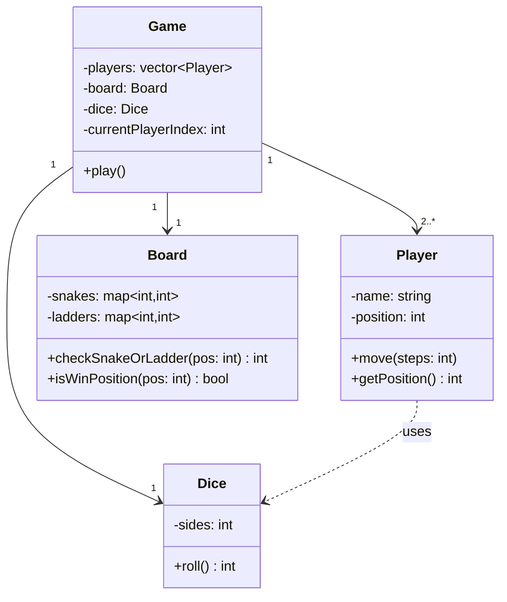

# Snake-Ladder-SBK
Snake &amp; Ladder SBK is a fun-filled board game experience that blends chance and strategy. Players race to the top of the board, climbing ladders to leap ahead while avoiding snakes that send them sliding back. 

